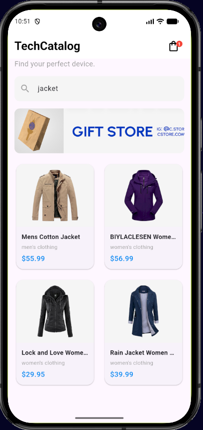
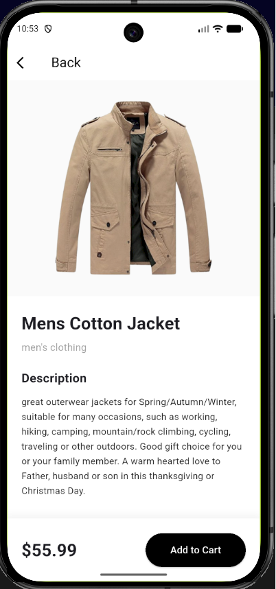
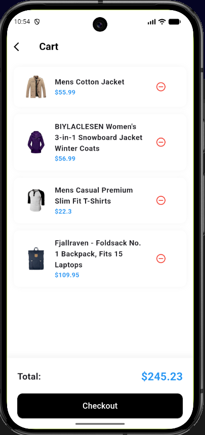
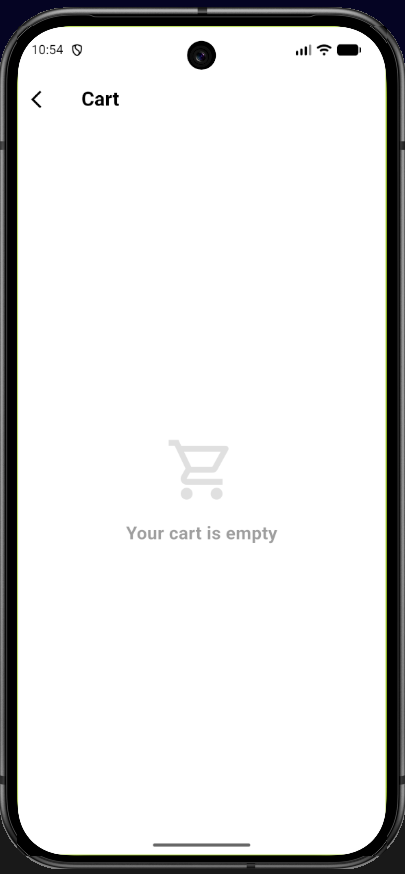

# Mini Katalog Uygulaması (Flutter)

Bu proje, Flutter eğitim haftası kapsamında geliştirilmiş temel seviye bir mobil e-ticaret (katalog) uygulamasıdır. Projede modern Flutter widget yapıları, sayfa yönlendirmeleri (Navigasyon), temel durum (state) yönetimi ve REST API üzerinden canlı veri çekme işlemleri uygulanmıştır.

## 📱 Proje Özellikleri

- **Dinamik Veri Çekme:** Eğitim PDF'inde belirtilen yönlendirmeler doğrultusunda, ürün verileri **FakeStore API** (`https://fakestoreapi.com/products`) üzerinden çekilmektedir.
- **Kategorize Edilmiş Arayüz:** GridView.builder kullanılarak ürünler karta dayalı, duyarlı (responsive) bir arayüzle listelenmektedir.
- **Canlı Arama (Arama Çubuğu):** Kullanıcılar, anasayfada yer alan arama çubuğu üzerinden ürün başlığına göre filtreleme yapabilir.
- **Detay Sayfası ve Veri Aktarımı:** Seçilen ürün, `Navigator` ve Route Arguments kullanılarak ürün detay sayfasına (`DetailView`) aktarılır. Detay sayfası görsel, başlık, fiyat ve ürün açıklaması barındırır.
- **Sepet Simülasyonu:** Global State simülasyonu sayesinde kullanıcılar ürünleri sepete ekleyebilir, Navbar'daki canlı sepet göstergesinde (Badge) ürün sayısını görebilir ve Sepet (`CartView`) sayfasından ürünleri listeden çıkartabilir.
- **Modern Mimari:** Klasörleme yapısı endüstri standartlarına uygun şekilde MVC (Model, View, Component, Service) mimarisine göre organize edilmiştir.

## 🛠️ Kullanılan Araçlar ve Sürümler

- **Geliştirme Ortamı:** Visual Studio Code
- **Flutter SDK Sürümü:** 3.44.2
- **Dart Sürümü:** 3.12.2
- **Kullanılan Paketler:** `http` (Ağ istekleri için), `cupertino_icons`

## 🚀 Çalıştırma Adımları

Bu projeyi kendi bilgisayarınızda çalıştırmak için aşağıdaki adımları izleyebilirsiniz:

1. Depoyu yerel makinenize klonlayın:
   ```bash
   git clone https://github.com/ufukabravaci/technocatalog.git
   ```
2. Projenin kök dizinine geçiş yapın:
   ```bash
   cd technocatalog
   ```
3. Gerekli Flutter paketlerini (`http` vb.) indirin:
   ```bash
   flutter pub get
   ```
4. Emülatörü veya fiziksel test cihazınızı bağlayın.
5. Uygulamayı başlatın:
   ```bash
   flutter run
   ```

## 📸 Ekran Görüntüleri

### Ana Sayfa


### Ürün Detay Sayfası


### Sepet Sayfası (İçi Dolu)


### Sepet Sayfası (İçi Boş)



---
*Bu proje eğitim çıktısı olarak hazırlanmıştır ve gerçek bir e-ticaret uygulamasının temel yapı taşlarını öğretmeyi hedeflemektedir.*